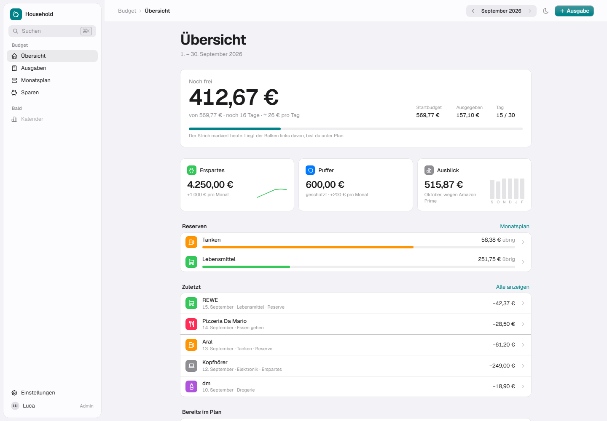
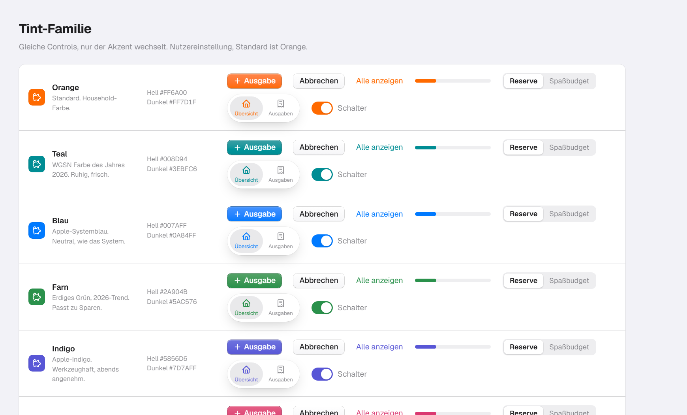
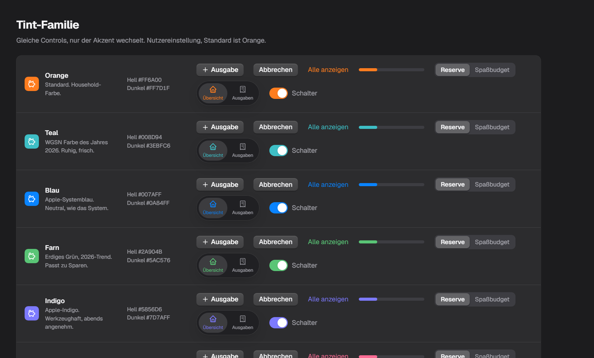
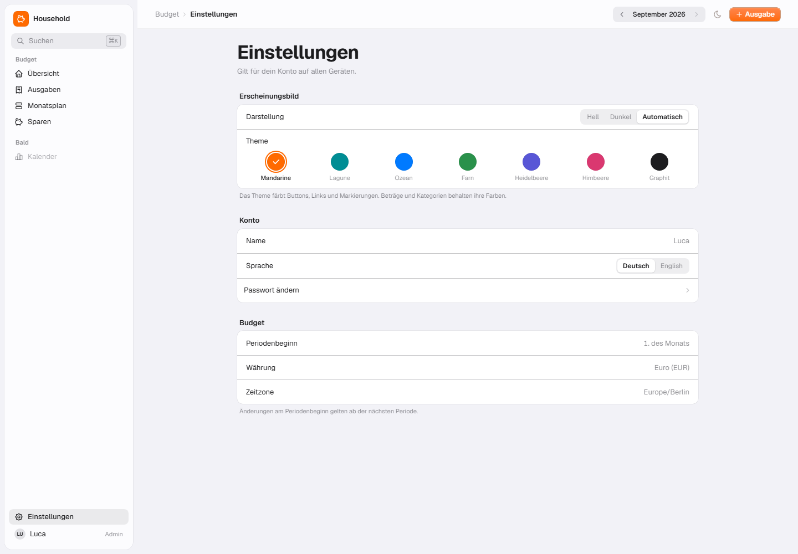
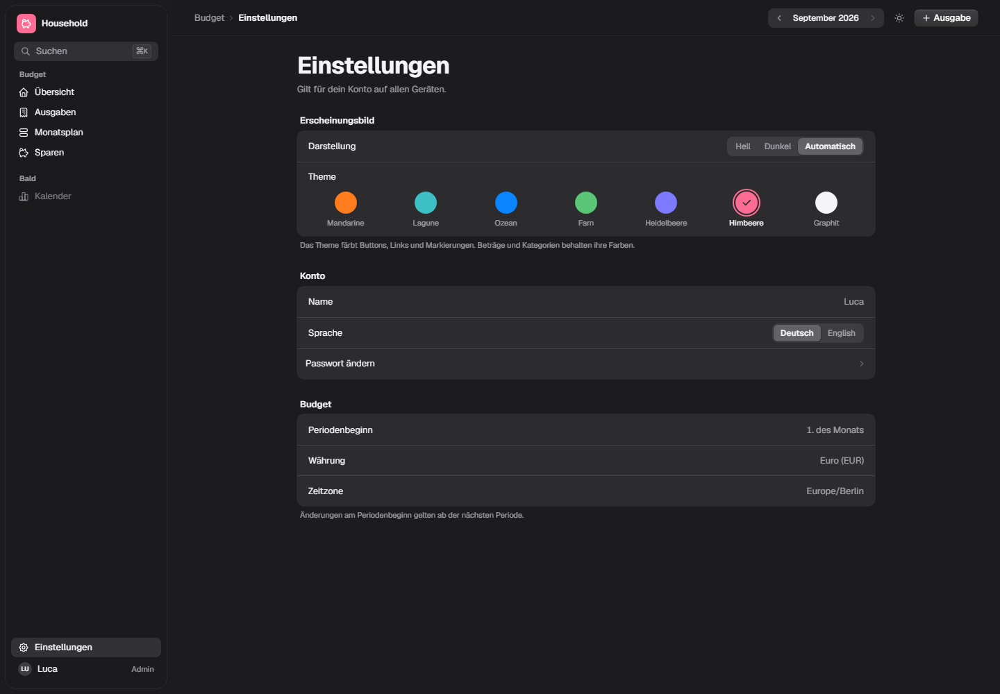

# UI-Redesign: Recherche 2026 und Variante E „Cupertino"

Status: Umgesetzt (Variante E, Theme Mandarine als Standard). Die Scratch-Seiten unter `/design/*` und
`clients/web/src/design-lab/` wurden nach der Umsetzung entfernt; die Screenshots in `2026-09-15/` bleiben als Referenz.
Datum: 2026-09-15

## 0. Was umgesetzt ist (Stand 2026-09-15)

- `app-shell.tsx` ist in Shell, Sidebar, Switcher, Login, Konto, Admin, Modul-Panel und Legacy-Budget-Panel aufgeteilt.
- Token in `globals.css`: gruppierte Hintergründe, Hairlines, Systemfarben, Glas nur für Sidebar, Toolbar, Tab-Bar und Sheet.
  Komponentenklassen `.surface-group`, `.hairline-rows`, `.glass`, `.push`, `.push-default`, `.seg`, `.icon-tile`.
- Themes: Katalog in `clients/web/src/lib/theme.ts`, Presets als `[data-theme]`-Regeln, Inline-Script vor dem ersten Paint,
  Auswahl unter Konto, gespeichert im Profil (`PATCH /users/me`, Spalte `identity.users.theme`).
- Inter ersetzt Geist als UI-Schrift.
- `Button`, `Card`, `Input`, `Tabs`, `Label`, `FormSelect` in der neuen Sprache; gruppierte Listen in `components/app/grouped.tsx`.
- Monatsbudget (`/budget/preview`): Übersicht, Ausgaben, Sparen, Monatsplan und der Ausgaben-Editor neu gebaut.
- Login, Konto und Admin-Einstellungen folgen derselben Sprache. Der alte Budget-Bereich (`/budget`) läuft unverändert auf den neuen Primitives.
Vorgänger: [2026-09-15-visuelle-richtungen.md](2026-09-15-visuelle-richtungen.md) (A bis D)

Auslöser: D sah gut aus, hatte aber Material-Design-Anleihen. Gewünscht ist Apple-Richtung mit Tiefe, leichten Verläufen und kleinen Controls, gestützt auf aktuelle Trends und Farbpaletten.

## 1. Was die Recherche hergibt

### Farbe 2026

| Quelle | Aussage | Konsequenz für Household |
| --- | --- | --- |
| Pantone Color of the Year 2026: Cloud Dancer (11-4201), ein weiches Weiß. Paletten „Powdered Pastels", „Atmospheric" (Weiß, Grauhimmel, klares Blau, Blaugrün), „Comfort Zone" | Ruhe, Klarheit, Weißraum als Statement | Canvas nicht reinweiß, sondern gebrochenes Weiß bzw. Apples gruppiertes Grau. Wenig Farbe, viel Luft. |
| WGSN/Coloro Colour of the Year 2026: Transformative Teal (Blau plus Wassergrün) | Frische, Ruhe, Wiederherstellung | Kandidat für die eine Akzentfarbe. |
| „Elevated Neutrals" (Sand, Stein, Taupe statt hartem Weiß), „ein einzelner gesättigter Akzent", „High-Contrast Dark Mode" | Neutrale Systeme, Akzent nur dort, wo es zählt | Ein Tint, semantisches Grün/Rot für Beträge, sonst Grau. |
| Grün wird 2026 Mainstream, blaugrün gilt als Leitfarbe | | Erspartes in Systemgrün, Puffer in Systemblau: semantisch und im Trend. |
| OKLCH ist im W3C Design Tokens Standard (Okt 2025) das kanonische Format; Browser-Support 96 % | | Token bleiben OKLCH, Apple-Systemfarben werden nur als Referenz genutzt. |

### Design-Trends 2026

| Trend | Quelle | Was wir übernehmen |
| --- | --- | --- |
| Calm Interfaces, Ende der „visuellen Theatralik"; Glassmorphism und Skeuomorphismus um ihrer selbst willen gelten als vorbei | Envato, Tubik | Glas nur auf der Navigationsebene, Inhalt auf deckenden Flächen. Keine Verläufe auf Flächen. |
| Motion mit Zweck, endlich, `prefers-reduced-motion` | Envato, Tubik, Landdding | Bleibt wie in A bis D: Einblenden beim Mount, sonst nichts. |
| Ledger-Ziffern, Tabular Nums, klare Ziffernformen bei kleinen Größen | Tubik, FontAlternatives | `tnum` global, Inter mit `cv11`/`ss01` für offene Ziffern. |
| Dark Mode als Fundament, Off-Black statt Schwarz, Ebenen über Helligkeit statt Schatten | Landdding | Dark Canvas `#1C1C1E`, Karten `#2C2C2E`, wie Apples sekundäre Systemhintergründe. |
| Modulare Karten mit konsistentem Radius und Abstand | Landdding, Fireart | Ein Radius (10 px) für alle Gruppen, ein Abstand. |
| Canva 2026: „Imperfect by Design", plus 54 % mehr Suchen nach clean layouts | Canva | Für eine Finanz-App zählt der zweite Teil. |

### Apple: was die neue Designsprache konkret vorgibt

| Regel | Quelle | Umsetzung in E |
| --- | --- | --- |
| Liquid Glass ist die Navigationsebene über dem Inhalt. Kein Glas auf Inhaltsflächen, kein Glas auf Glas. | Apple HIG Materials, WWDC25 „Meet Liquid Glass", LogRocket | Toolbar, schwebende Sidebar und Tab-Bar sind Glas. Karten und Listen sind deckend. |
| Mini, Small, Medium Controls sind abgerundete Rechtecke; erst Large und XL werden Kapseln (macOS wie iOS) | WWDC25 Session 356 | Buttons 24 px hoch, Radius 6 px. Nur die Tab-Bar ist eine Kapsel. |
| Konzentrizität: innere Radien folgen dem äußeren Radius minus Abstand | WWDC25 356, Apple Newsroom | Sidebar-Panel 12 px, Gruppen 10 px, Icon-Kacheln 7 px, Segmente 6 px in 8 px Schiene. |
| Hierarchie kommt aus Layout und Gruppierung, nicht aus Dekoration | WWDC25 356 | Große Titel, gruppierte Listen, Abschnittsüberschriften. Keine getönten Kacheln. |
| Tab-Bar: schwebende Kapsel, eigener Such-Tab, keine bildschirmspezifischen Aktionen in der Tab-Bar; primäre Aktion gehört in die Toolbar | WWDC25 356, Donny Wals, iOS 26 | Kein FAB. „Ausgabe" oben in der Toolbar; auf Mobile ein separater runder Glas-Button neben der Kapsel. |
| Sidebar-Icons in Tahoe sind schwarz/weiß, nicht getönt; Sidebar schwebt als Panel | Mario Guzman Sidebar Guidelines, MacRumors | Sidebar-Icons einfarbig, Panel mit Blur und Hairline, 8 px vom Rand. |
| Eine Tint-Farbe. Systemfarben semantisch: Grün positiv, Rot negativ, Orange Warnung | Apple HIG Color, Sarunw Cheat Sheet | Tint umschaltbar (`?tint=teal\|orange\|blue`). Erstattungen grün. |
| Hintergrundhierarchie: gruppiert `#F2F2F7` / `#FFFFFF`, dunkel `#1C1C1E` / `#2C2C2E`; Separator `rgb(60 60 67 / 0.29)` | Sarunw, Apple HIG | Exakt so als Token. |
| macOS Push Button: kleine Höhe, feiner Rand, leichter vertikaler Verlauf, Default-Button in Tint | mackuba NSButton Guide, Six Colors Tahoe Review | `.e-btn` und `.e-btn-default` in `lab.css`. Das ist der gewünschte „leichte Verlauf, aber klein". |
| Typografie: SF Pro; body 13 pt auf macOS, 17 pt auf iOS; Large Title 34 pt; Inter ist mit 92 % Ähnlichkeit die nächste freie Alternative | Superdesign, FontAlternatives | Inter via `next/font`, 13 px Grundschrift, 28 bis 34 px Titel, 44 bis 52 px Hero-Zahl. |
| Copilot Money (Apple Design Award Finalist): native Komponenten, Rot/Grün/Blau-Charts auf Weiß, Daten lokal, „very picky" | Apple Developer Article | Bestätigt: Charts dünn, farbig nur die Linie, Fläche weiß. |
| Kritik an Tahoe: zu harte Button-Schatten, „Platten auf grauem Grund" | Benjamin Mayo, Six Colors | Schatten auf 0,5 px Hairline plus 1 px weichem Schatten begrenzt. |

## 2. Warum D nach Material aussah

| Material-Signal in D | Apple-Entsprechung in E |
| --- | --- |
| Tonal getönte Container (grüne, blaue, orange Kacheln) | Weiße Gruppen auf grauem Canvas, Farbe nur in 28 px Icon-Kacheln |
| FAB in der Bottom-Bar | Kapsel-Tab-Bar plus separater Glas-Button; primäre Aktion in der Toolbar |
| Initialen-Avatare in Kreisen | SF-Symbol-artige Glyphen in farbigen abgerundeten Quadraten (Einstellungen-App) |
| Icon-Buttons in getönten Kreisen oben rechts | Toolbar-Buttons ohne Platte, Platte erst beim Hover |
| Bento-Grid mit 16 px Radius auf getöntem Grund | Inset Grouped Lists mit 10 px Radius, Hairline-Separatoren, Disclosure-Chevrons |
| Verlauf und innere Lichtkante auf jeder Fläche | Flächen flach; Verlauf nur auf Push-Buttons |
| Balkendiagramm mit Pillen | Rechteckige Balken wie Swift Charts |
| Sidebar als Kachel mit erhabenem Aktiv-Eintrag | Schwebendes Glas-Panel, Aktiv-Eintrag als grauer Fill |

## 3. Variante E „Cupertino"

- **Canvas** gruppiertes Grau, **Gruppen** weiß mit 0,5 px Hairline, 10 px Radius. Kein Schatten auf Inhalt.
- **Ein Tint**, standardmäßig ein Teal aus der 2026-Recherche. Orange (Bestand) und Apple-Blau sind als Vergleich umschaltbar: [Orange](2026-09-15/e-overview-orange.png), [Blau](2026-09-15/e-overview-blue.png).
- **Semantische Farbe** nur klein: Icon-Kacheln in Apple-Systemfarben, Erstattungen grün, Reserve-Balken in der Kategoriefarbe.
- **Glas** nur auf Sidebar, Toolbar und Tab-Bar. Der Inhalt darunter bleibt deckend.
- **Buttons**: macOS Push Buttons, 24 px, Radius 6 px, Weiß-nach-Hellgrau-Verlauf mit Hairline. Der Default-Button trägt den Tint als Verlauf. Toolbar-Buttons ohne Platte.
- **Typografie**: Inter mit `cv11`/`ss01`/`tnum`, 13 px Grundschrift, Large Title 34 px, Hero-Zahl 52 px.
- **Pacing-Strich** im Fortschrittsbalken, mit einem Satz erklärt.
- **Mobile**: Large Title, gruppierte Listen, schwebende Kapsel-Tab-Bar plus runder Glas-Button für „Ausgabe". Kein FAB.
- **Editor**: Sheet im Formular-Stil (Abbrechen / Titel / Sichern in der Kopfzeile, gruppierte Zeilen, Segment-Control für die Quelle).

Weitere Screens: [Dark](2026-09-15/e-overview-dark.png) · [Ausgaben](2026-09-15/e-expenses-light.png) · [Editor](2026-09-15/e-editor-light.png) · [Detail 2x](2026-09-15/e-detail-2x.png) · [Mobile D vs E](2026-09-15/phones-de-light.png)

Alle Regeln liegen als Klassen in `lab.css` (`.e-group`, `.e-sep`, `.e-glass`, `.e-btn`, `.e-btn-default`, `.e-tool`, `.e-seg`, `.e-search`, `.e-icon`, `.e-bar`, `.e-tabbar`). Beim Umsetzen werden daraus Varianten von `Button`, `Card`, `Input`, `Tabs` und eine neue `Sidebar`.

## 4. Offene Entscheidungen

1. **Tint**: Teal (2026, ruhig, kein Warn-Orange), Orange (Bestand, Wiedererkennung) oder Apple-Blau (neutral, „System").
2. **Sidebar-Icons** einfarbig (Tahoe) oder im Tint (macOS bis Sequoia).
3. **Hero-Karte**: Zahl in einer weißen Gruppe (wie jetzt) oder direkt auf dem Canvas unter dem Large Title (noch ruhiger, wie Wallet).

## Quellen

- Pantone, Color of the Year 2026: https://www.pantone.com/na/en-us/color-of-the-year/2026 und Paletten: https://www.pantone.com/na/en-us/articles/color-of-the-year/color-of-the-year-2026-color-palettes
- WGSN/Coloro, Transformative Teal: https://www.wgsn.com/en/blog/colour-year-2026-transformative-teal
- Updivision, UI Color Trends 2026: https://updivision.com/blog/post/ui-color-trends-to-watch-in-2026
- AND Academy, Color Trends 2026: https://www.andacademy.com/resources/blog/graphic-design/color-trends-for-designers/
- Envato, UX/UI Trends 2026: https://elements.envato.com/learn/ux-ui-design-trends
- Tubik, 7 UI Design Trends 2026: https://tubikstudio.com/blog/ui-design-trends-2026/
- Landdding, UI Design Trends 2026: https://landdding.com/blog/ui-design-trends-2026
- Fireart, Web Design Trends 2026: https://fireart.studio/blog/the-best-web-design-trends/
- Canva Design Trends 2026: https://www.businesswire.com/news/home/20251210696597/en/Canva-Unveils-2026-Design-Trends-The-Year-of-Imperfect-by-Design
- Apple Newsroom, neue Designsprache: https://www.apple.com/newsroom/2025/06/apple-introduces-a-delightful-and-elegant-new-software-design/
- WWDC25 356, Get to know the new design system: https://developer.apple.com/videos/play/wwdc2025/356/
- WWDC25 219, Meet Liquid Glass: https://developer.apple.com/videos/play/wwdc2025/219/
- Apple HIG Materials: https://developer.apple.com/design/human-interface-guidelines/materials
- Apple HIG Color: https://developer.apple.com/design/human-interface-guidelines/color
- LogRocket, Adopting Liquid Glass: https://blog.logrocket.com/ux-design/adopting-liquid-glass-examples-best-practices/
- Donny Wals, Tab bars on iOS 26: https://www.donnywals.com/exploring-tab-bars-on-ios-26-with-liquid-glass/
- Mario Guzman, Sidebar Guidelines: https://marioaguzman.github.io/design/sidebarguidelines/
- Benjamin Mayo, Tahoe Toolbars: https://bzamayo.com/tahoe-toolbars
- Six Colors, macOS Tahoe Review: https://sixcolors.com/post/2025/09/macos-26-tahoe-review-power-under-glass/
- Sarunw, Dark color cheat sheet (Systemfarben): https://sarunw.com/posts/dark-color-cheat-sheet/
- Superdesign, Apple Design System Breakdown: https://superdesign.dev/blog/apple-design-system
- FontAlternatives, San Francisco alternatives: https://fontalternatives.com/alternatives/san-francisco/
- Apple Developer, Copilot Money: https://developer.apple.com/articles/copilot-money
- UXPin, iOS vs Android UI 2026: https://www.uxpin.com/studio/blog/ios-vs-andoid-ui-design-for-mobile/
- Design Tokens Color Module (W3C): https://www.designtokens.org/tr/drafts/color/
- Front-End Checklist, OKLCH: https://frontendchecklist.io/rules/css/color-oklch

## 5. Tint-Familie (Nachtrag, Nutzereinstellung)

Entscheidung: E ist gesetzt, `#FF6A00` ist der Standard-Tint. Weitere Tints sind eine Nutzereinstellung.
Das System bleibt neutral (Grau, Weiß, Hairlines); nur `--primary` wechselt. Kategoriefarben bleiben
semantisch und wechseln nicht mit, deshalb ist Tanken von Systemorange auf Systembraun gewandert.

| Tint | Hell | Weiß auf Tint | Tint als Text auf `#F2F2F7` | Dunkel | Weiß auf Tint | Tint als Text auf `#1C1C1E` | Herkunft |
| --- | --- | ---: | ---: | --- | ---: | ---: | --- |
| Orange (Standard) | `#FF6A00` | 2,9 | 2,6 | `#FF7D1F` | 2,6 | 6,7 | Household |
| Teal | `#008D94` | 4,0 | 3,6 | `#3EBFC6` | 2,2 | 7,7 | WGSN Colour of the Year 2026 |
| Blau | `#007AFF` | 4,0 | 3,6 | `#0A84FF` | 3,7 | 4,7 | Apple systemBlue |
| Farn | `#2A904B` | 4,1 | 3,6 | `#5AC576` | 2,2 | 7,9 | Erdige Grüntöne 2026 |
| Indigo | `#5856D6` | 5,7 | 5,1 | `#7D7AFF` | 3,4 | 4,9 | Apple systemIndigo |
| Himbeere | `#DA3870` | 4,4 | 3,9 | `#FD6C95` | 2,7 | 6,3 | Pantone „Take a Break" Richtung |
| Graphit | `#1D1D1F` | 16,8 | 15,1 | `#F5F5F7` | 15,5 (Ink auf Tint) | 15,6 | Apple Wallet, Ink |

Lesart der Zahlen: WCAG AA verlangt 4,5:1 für Fließtext und 3:1 für große Schrift oder UI-Komponenten.
Apple selbst unterschreitet mit Weiß auf systemOrange (2,9) und systemGreen die 3:1. Konsequenz für uns:

- **Buttons** tragen Weiß auf Tint. Bei Orange, Teal dunkel, Farn dunkel und Himbeere liegt das unter 3:1.
  Vorschlag: Der Default-Button nutzt `color-mix(in oklab, var(--primary) 82%, black)` als Fläche,
  dann erreicht `#FF6A00` als `#D65900` etwa 4,0:1 und bleibt erkennbar orange. Links, Balken, aktive Tabs
  und Icons behalten den reinen Tint, dort ist 3:1 gegen den Hintergrund erfüllt oder es sind Grafiken.
- **Dark Mode** ist für Tint-als-Text unproblematisch (alle über 4,5:1), aber Weiß auf hellem Tint kippt.
  Dort gilt derselbe Button-Abdunkler.
- **Graphit** ist der Ausweg für alle, die gar keine Akzentfarbe wollen. Im Dark Mode ist der Default-Button
  weiß mit dunkler Schrift, wie in Wallet.

Umsetzung als Einstellung: ein `data-tint`-Attribut auf `<html>`, gesetzt aus dem Nutzerprofil beim Laden
(und vor dem ersten Paint per Inline-Script, wie `next-themes` es für dark/light macht). Die Presets sind reine
CSS-Regeln, kein Laufzeit-JavaScript. Ein freier Hex-Wert ist technisch möglich (siehe `?tint=FF6A00`), als
Nutzereinstellung würde ich ihn aber weglassen: ohne Kontrastprüfung landet jemand bei Gelb auf Weiß.

Vergleichsseiten: `/design/swatches` (gleiche Controls, alle Tints) und `/design/tints` (ganze Übersicht je Tint),
beide mit `?theme=dark`.

## 6. Themes mit Namen und Auswahl (Nachtrag)

Entscheidung: E bleibt wie gebaut (Sidebar-Icons einfarbig, Hero-Zahl in der Gruppe). Themes bekommen
Namen und sind vom Nutzer wählbar. Katalog in `clients/web/src/design-lab/themes.ts`:

| Id | Name (de / en) | Hell | Dunkel |
| --- | --- | --- | --- |
| `mandarine` | Mandarine / Tangerine (Standard) | `#FF6A00` | `#FF7D1F` |
| `lagune` | Lagune / Lagoon | `#008D94` | `#3EBFC6` |
| `ozean` | Ozean / Ocean | `#007AFF` | `#0A84FF` |
| `farn` | Farn / Fern | `#2A904B` | `#5AC576` |
| `heidelbeere` | Heidelbeere / Blueberry | `#5856D6` | `#7D7AFF` |
| `himbeere` | Himbeere / Raspberry | `#DA3870` | `#FD6C95` |
| `graphit` | Graphit / Graphite | `#1D1D1F` | `#F5F5F7` |

Die Id ist der gespeicherte Wert im Profil, sprachneutral und stabil. Namen kommen aus i18n.

Die Auswahl sitzt unter Einstellungen, Gruppe „Erscheinungsbild": Darstellung (Hell, Dunkel, Automatisch)
als Segment-Control, darunter das Theme als Reihe farbiger Kreise mit Namen, das gewählte mit Ring und Haken,
wie die Akzentfarbe in den macOS-Systemeinstellungen. Scratch: `/design/e?screen=settings`.

Umsetzung später: `PATCH /users/me` bekommt `theme`, der Client setzt `data-theme` auf `<html>` vor dem
ersten Paint (Inline-Script wie bei `next-themes`) und nach jedem Wechsel sofort. Die Presets sind CSS.
