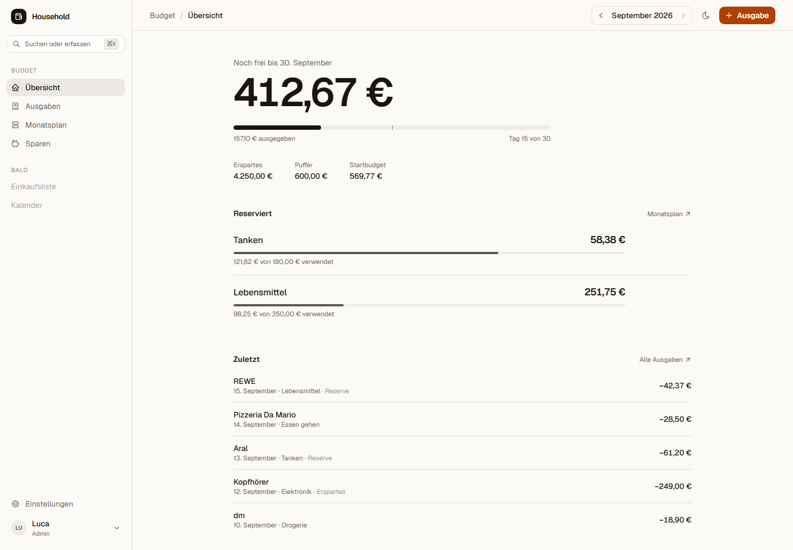
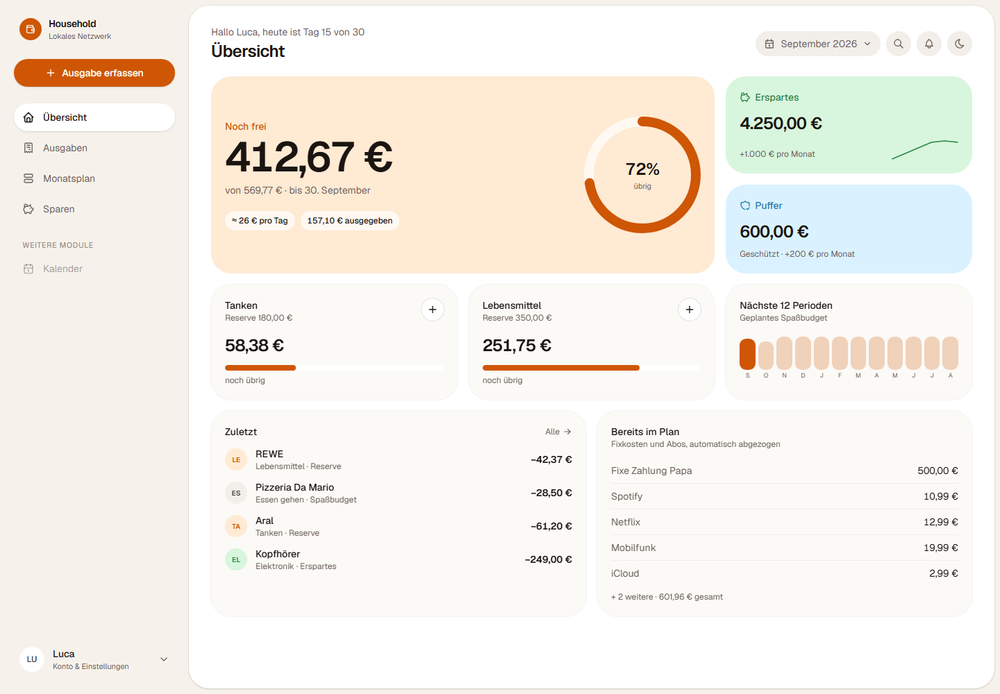
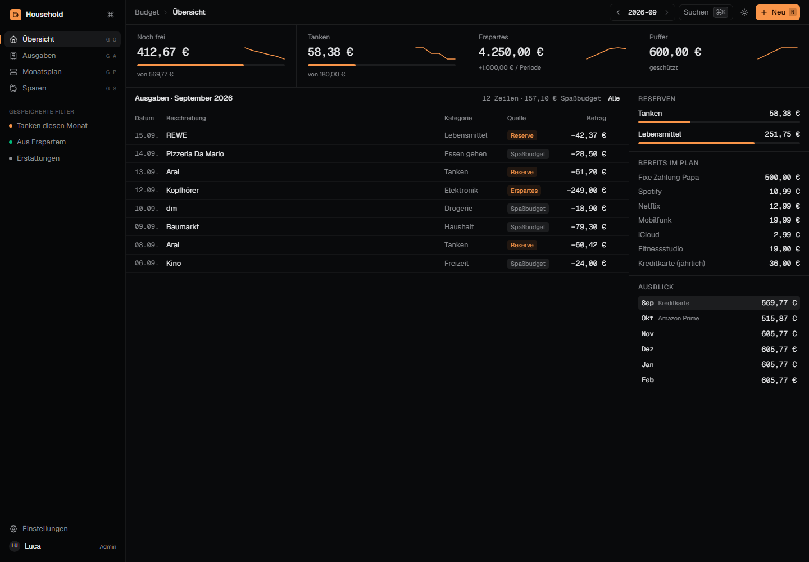
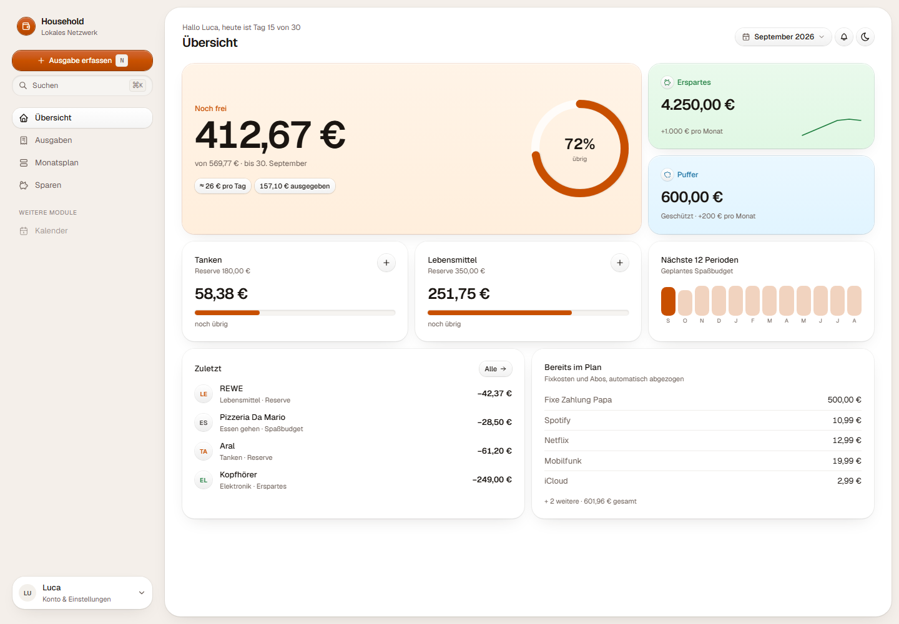
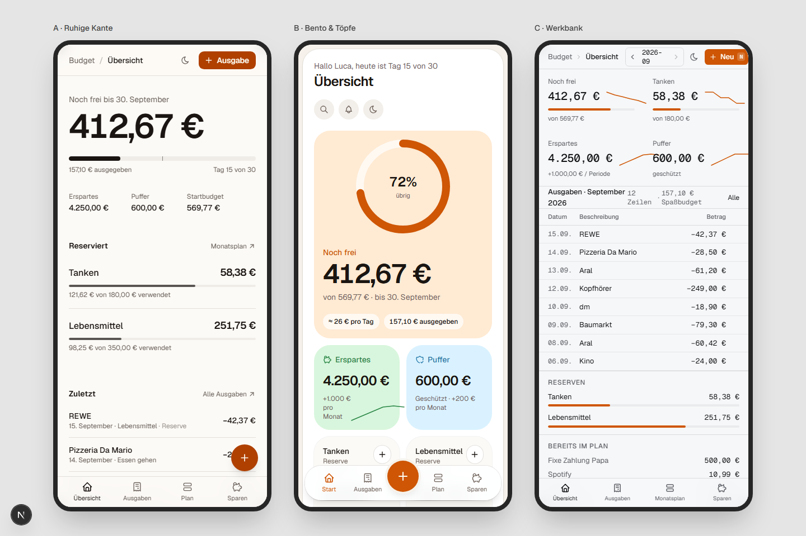
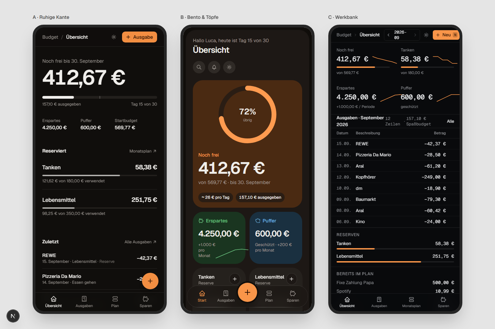

# UI-Redesign: Drei visuelle Richtungen (A / B / C)

Status: Entscheidung gefallen (Variante E, siehe [2026-09-15-recherche-und-cupertino.md](2026-09-15-recherche-und-cupertino.md)). Die Scratch-Seiten wurden entfernt, die Screenshots bleiben.
Datum: 2026-09-15
Bezug: Monatsplan-Modell aus `docs/budget/monthly-budget-preview.md`; die vier IA-Entwürfe vom 2026-08-06 in diesem Ordner.

## Was das hier ist

Die vier Entwürfe vom August klären die Informationsarchitektur (welche Screens, welche Navigation).
Dieses Dokument klärt die **visuelle Sprache**: Wie fühlt sich die App an, wenn man sie öffnet?

Drei Richtungen wurden als Scratch-Seiten mit Mock-Daten gebaut. Sie laufen im Web-Client ohne Backend und ohne Login:

| Route | Inhalt |
| --- | --- |
| `/design/a`, `/design/b`, `/design/c`, `/design/d` | Übersicht der jeweiligen Richtung |
| `?screen=expenses` | Ausgaben-Liste |
| `?editor=1` | Ausgabe-Erfassen geöffnet |
| `?theme=dark` | Dark Mode erzwingen |
| `/design/phones` | Alle nebeneinander im Handy-Format, `?only=b,d` filtert |

Code liegt in `clients/web/src/design-lab/`. Der einzige Eingriff in echten Code ist ein Early-Return in `AppShell` für `/design/*`.
Beides wird beim Umsetzen entfernt oder in die echten Komponenten überführt.

## Was aus den Trends 2025/26 übernommen ist

Alle drei Richtungen teilen diese Grundlagen. Sie sind unabhängig von der Wahl gesetzt:

- **Eine Zahl dominiert.** „Noch frei" ist auf jedem Startscreen das größte Element. Alles andere ist sekundär.
- **Hairlines statt Schatten.** Flächen trennen sich über 1px-Ränder und Tonwertstufen, nicht über Drop-Shadows. Dark Mode funktioniert damit ohne Sonderfälle.
- **OKLCH-Token, warm getönte Neutrals.** Kein reines Grau. Die bestehende Akzentfarbe (gebranntes Orange) bleibt, wird aber sparsam eingesetzt.
- **Frosted Sticky Header** mit Breadcrumb, Periodenwahl und dem Primär-Button „Ausgabe".
- **Command Palette (⌘K)** als Einstieg für Suche und Erfassen. Keyboard-first, aber nicht keyboard-only.
- **Sidebar mit echter Verschachtelung**, Konto und Einstellungen nur im Sidebar-Footer. Kein Doppel mit dem Header.
- **Mobile: Bottom-Tab-Bar plus zentraler Erfassen-Button.** Die Sidebar verschwindet unter `lg`.
- **Progressive Disclosure.** „Bereits im Plan" und der 12-Perioden-Ausblick sind eingeklappt oder in einer Seitenspalte. Sie stören die Hauptfrage nicht.
- **Endliche Bewegung.** Einblenden beim Mount, Ring füllt sich einmal. Keine Endlosschleifen.
- **Tabular Nums** für alle Beträge, damit Spalten ruhig stehen.
- **Pacing-Marker.** Der Fortschrittsbalken zeigt, wo „heute" in der Periode liegt. So sieht man ohne Rechnen, ob man vor oder hinter dem Budget liegt.

Verworfen: Glassmorphism auf Karten (Lesbarkeit), dekorative Display-Fonts als UI-Font (Regel im Web-CLAUDE.md), Farbverläufe als Flächen.

## A · Ruhige Kante

**Paradigma:** Editorial, Linear/Notion-Ruhe. Warmes Papier, ein Akzent, viel Weißraum, Listen statt Karten.

- Hero-Zahl 64–72px mit Pacing-Balken und drei Inline-Stats darunter.
- Reserven als Liste mit dünnen Balken. Aktionen erscheinen erst beim Hover.
- Ausgaben tagesweise gruppiert, Filter als Pills, Hover-Aktionen in der Zeile.
- Editor als rechtes Sheet: Betrag als große Unterstrich-Eingabe, Kategorie als Chips, Quelle als Segment-Control.
- Radius 12px, Sidebar 240px hell, Aktiv-Zustand als dezente Pille.

**Stärke:** Am wenigsten Lärm, altert am besten, sehr wenig eigene Komponenten nötig.
**Schwäche:** Auf großen Bildschirmen bleibt rechts viel leer. Reserven und Erspartes wirken weniger „greifbar" als Töpfe.

Weitere Screens: [Dark](2026-09-15/a-overview-dark.png) · [Ausgaben](2026-09-15/a-expenses-light.png) · [Editor](2026-09-15/a-editor-light.png)

## B · Bento & Töpfe

**Paradigma:** Consumer-Fintech (Copilot, N26, Ivy). Bento-Grid, Töpfe mit Füllstand, Pastell-Tints pro Geldquelle.

- Inset-Sidebar: die Hauptfläche ist eine weiße Karte auf getöntem Grund. Primär-Button „Ausgabe erfassen" sitzt oben in der Sidebar.
- Hero-Kachel mit Ring-Gauge (72 % übrig) plus Chips „≈ 26 € pro Tag" und „ausgegeben".
- Erspartes (grün) und Puffer (blau) als getönte Kacheln mit Sparkline.
- Jede Reserve ist eine Kachel mit Plus-Button zum direkten Erfassen.
- Ausgaben als Tageskarten mit Kategorie-Avataren, rechts eine Zusammenfassung.
- Editor als Bottom-Sheet (Desktop: zentriertes Modal) mit großem Betragsfeld und Quellen-Karten mit Restbetrag.
- Radius 16px, drei Tint-Token (`--pot-fun`, `--pot-savings`, `--pot-buffer`).

**Stärke:** Sofort verständlich, fühlt sich wie eine Banking-App an. Töpfe sind visuell greifbar. Mobile am stärksten.
**Schwäche:** Meiste Farbe, meiste Kacheln. Mit vielen Kategorien wird das Grid unruhig. Braucht Disziplin bei neuen Modulen.

Weitere Screens: [Dark](2026-09-15/b-overview-dark.png) · [Ausgaben](2026-09-15/b-expenses-light.png) · [Editor](2026-09-15/b-editor-light.png)

## C · Werkbank

**Paradigma:** Power-Tool (Linear, Raycast). Dicht, dark-first, Tastatur überall, Tabellen statt Listen.

- KPI-Leiste mit vier Kennzahlen, Sparkline und Balken, durch Hairlines getrennt.
- Ausgaben als echte Tabelle mit Spalten, Quelle als Badge, Zeilenmenü beim Hover.
- Rechte Rail: Reserven, „Bereits im Plan", Ausblick als kompakte Zeilen.
- Sidebar 224px mit Tastenkürzeln (G O, G A …) und gespeicherten Filtern. Aktiv-Zustand als linker Akzentstrich.
- Header 44px mit Perioden-Stepper `2026-09`, Suche ⌘K, „Neu N".
- Monospace-Ziffern für Beträge, 13px Grundschrift, Radius 8px.

**Stärke:** Höchste Informationsdichte pro Bildschirm. Sehr schnell für jemanden, der jeden Tag erfasst. Dark Mode ist hier Heimat, nicht Nachgedanke.
**Schwäche:** Für Mitbewohner ohne Tool-Affinität am kühlsten. Mobile trägt Tabellen schlecht. Fühlt sich weniger wie „Haushalt", mehr wie „Buchhaltung" an.

Weitere Screens: [Light](2026-09-15/c-overview-light.png) · [Ausgaben](2026-09-15/c-expenses-light.png) · [Editor](2026-09-15/c-editor-light.png)

## D · Relief (Nachtrag nach Feedback vom 2026-09-15)

Feedback zu A: zu generisch. Gewünscht: mehr Tiefe, leichte Verläufe auf Buttons, dabei kleinere Buttons.

**Paradigma:** B's Grundriss mit taktiler Tiefe (Linear-Buttons, Family-App, Raycast). Flächen liegen sichtbar übereinander, Controls sind klein und präzise.

- Flächen: Hairline plus weicher Ambient-Schatten plus 1px innere Lichtkante oben. Getönte Kacheln haben einen leichten Verlauf von hell nach Tint.
- Primär-Button: vertikaler Verlauf (heller oben, dunkler unten), Hairline im dunkleren Ton, innere Lichtkante, dezenter Text-Schatten. Höhe 28–32px, Schrift 12px.
- Sekundär-Button: Weiß-nach-Hellgrau-Verlauf mit derselben Lichtkante. Chips, Icon-Buttons und Zeilenaktionen nutzen dieselbe Klasse.
- Eingaben und Suchfeld sind vertieft (inset shadow), Segment-Controls haben eine vertiefte Schiene und einen erhabenen Daumen.
- Aktiver Sidebar-Eintrag ist erhaben, das Nutzer-Element unten ist eine kleine Karte.
- Grundschrift 13px, Radius 14px, Fortschrittsbalken mit vertiefter Schiene.
- Dark Mode: Lichtkanten werden auf 6–8 % Weiß reduziert, Schatten dunkler, Verläufe bleiben.

Alle Tiefen-Regeln liegen in `lab.css` als `.d-card`, `.d-tint`, `.d-btn`, `.d-btn-primary`, `.d-inset`, `.d-seg`, `.d-nav-on`, `.d-icon`. Das wären beim Umsetzen die Varianten von `Button`, `Card` und `Input` in `components/ui`.

**Stärke:** Fühlt sich gebaut an statt gezeichnet, ohne laut zu werden. Kleine Controls halten die Dichte hoch.
**Schwäche:** Mehr CSS-Disziplin nötig, jede neue Fläche muss eine der Klassen benutzen, sonst bricht die Tiefe.

Weitere Screens: [Dark](2026-09-15/d-overview-dark.png) · [Ausgaben](2026-09-15/d-expenses-light.png) · [Editor](2026-09-15/d-editor-light.png) · [Detail 2x](2026-09-15/d-detail-2x.png) · [Mobile B vs D](2026-09-15/phones-bd-light.png)

## Mobile im Vergleich

## Empfehlung

Nach dem Feedback: **D.** B's Grundriss mit Tiefe und kompakten Controls. Der ursprüngliche Vorschlag steht darunter.

**B als Basis, mit der Zurückhaltung von A.**

Begründung: Das neue Monatsplan-Modell besteht aus benannten Töpfen (Spaßbudget, Reserven, Erspartes, Puffer).
B macht diese Töpfe sichtbar und anfassbar, das passt zum Modell. A ist die schönere Ruhe, aber Erspartes und Puffer bleiben dort Text.
C ist die richtige Richtung für die Ausgaben-Liste bei viel Historie, aber nicht für die tägliche Frage „Darf ich das noch ausgeben?".

Konkret als Mischung:

1. Shell und Töpfe aus **B** (Inset-Sidebar, Hero-Kachel mit Ring, Tint-Token, Bottom-Bar mit Plus).
2. Typografie, Hairlines und Hover-Aktionen aus **A** (weniger Kacheln unterhalb der Hero-Zeile, Listen für „Zuletzt" und „Bereits im Plan").
3. Aus **C** nur die Ausgaben-Ansicht ab einer gewissen Datenmenge: Tabellenspalten auf Desktop, Karten auf Mobile. Plus ⌘K und die Tastenkürzel.

## Was beim Umsetzen passiert (nach der Entscheidung)

- `app-shell.tsx` (4.800 Zeilen) wird in Shell, Navigation, Login, Account, Admin und Budget-Panels aufgeteilt. Das ist die Voraussetzung, sonst landet das Redesign in derselben Datei.
- Token in `globals.css` werden auf die gewählte Palette umgestellt. Tint-Token für Töpfe kommen dazu, falls B gewählt wird.
- shadcn `sidebar`, `sheet` (vorhanden), `command`, `tooltip`, `table` werden ergänzt.
- Die Monatsplan-Preview unter `/budget/preview` bekommt die neue Sprache zuerst. Der alte Budget-Bereich folgt beim Cutover oder wird abgelöst.
- Login, Konto und Admin-Einstellungen werden in derselben Sprache nachgezogen (nicht Teil der Scratch-Seiten).
- `src/design-lab/` und der Early-Return in `AppShell` werden entfernt.

Offene Fragen, die die Entscheidung nicht blockieren: Ob „Spaßbudget" als Wort bleibt oder „Noch frei" der Begriff wird. Ob der Ausblick auf die Übersicht gehört oder nur in den Monatsplan.
